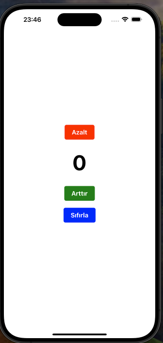

# Props (Data Transfer)

- With methods for transferring data from one member to another
- Always have the correct view of data managed from the top level.

# State

# useEffect

The event of the component appearing on the screen. ComponentDidMount--Dogma

1. 1st parameter -> callback function to be run
2. 2nd parameter -> an empty dependency array

-- `useEffect(()=>{},[])`
The event of the component leaving the screen: ComponentWillUnmount.

1. 1st parameter -> the callback function to execute
2. 2. 2nd parameter -> an empty dependency array
   --A function is added to the return statement of the function to be executed, and this function is triggered when the component leaves the screen.

-- `useEffect(()=> {return ()=>{}},[])`

The change that occurs when the component receives new props or state: `ComponentDidUpdate` – Update.

1. 1st parameter -> the callback function to execute
2. 2nd parameter -> none

-- `useEffect(()=>{})`

The change that occurs when the component receives new props or state: `ComponentDidUpdate` – 2nd parameter.

1. 1st parameter -> the callback function to execute  
2. 2nd parameter -> a filled dependency array

-- `useEffect(()=>{},[page,button,count])`

## Screenshot

